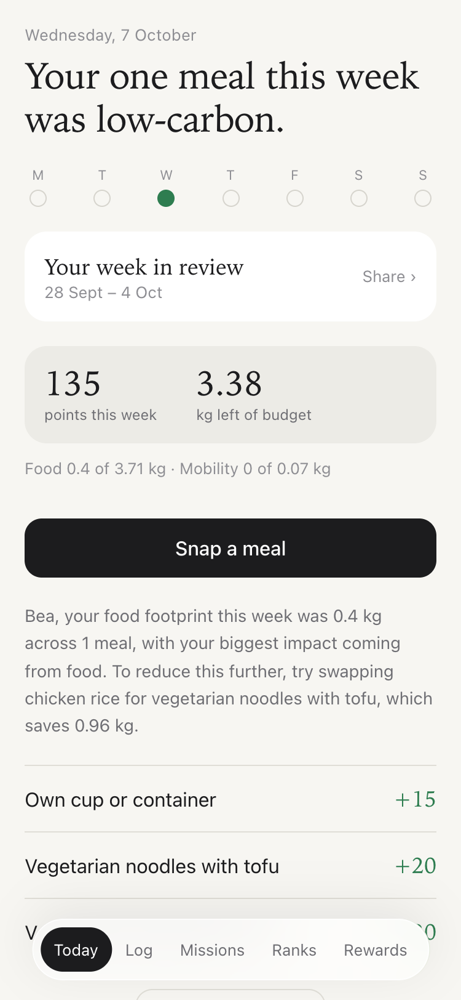
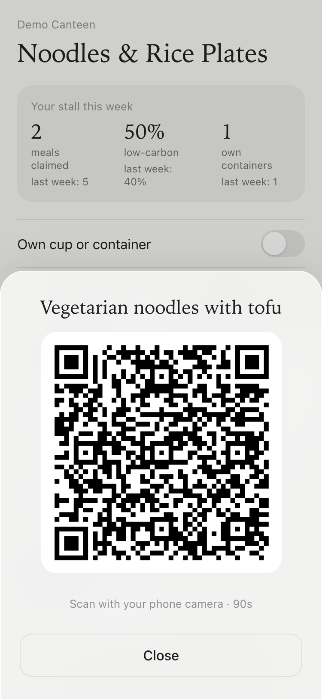
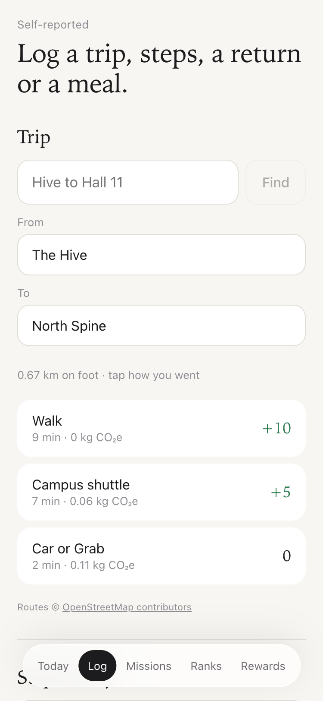
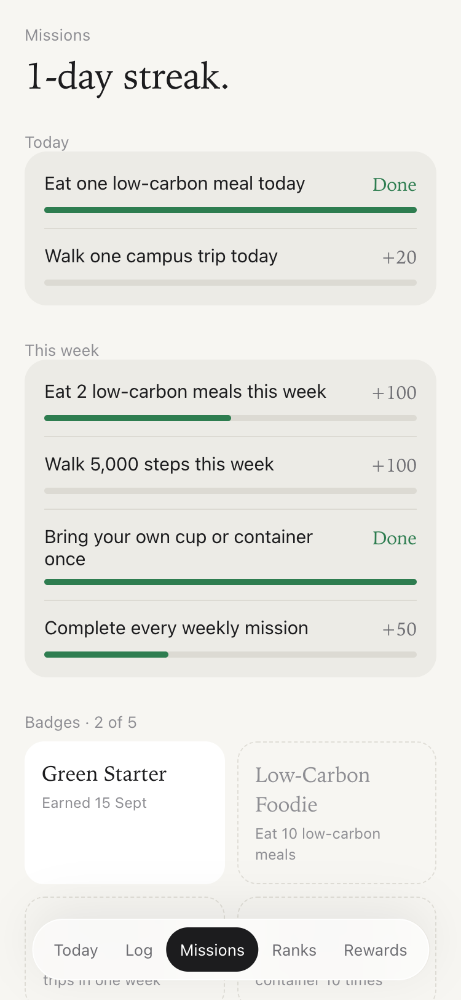
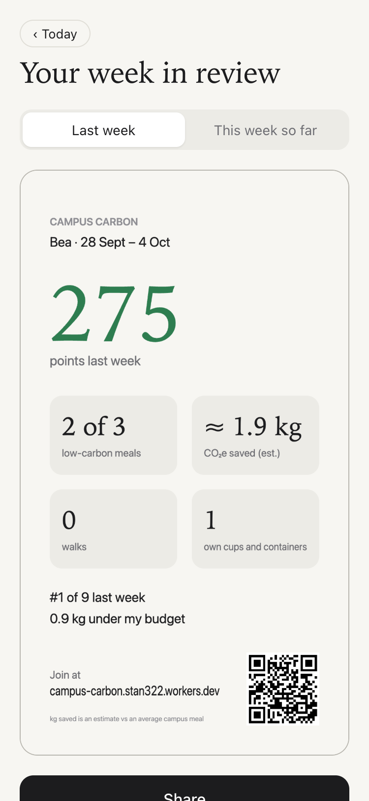
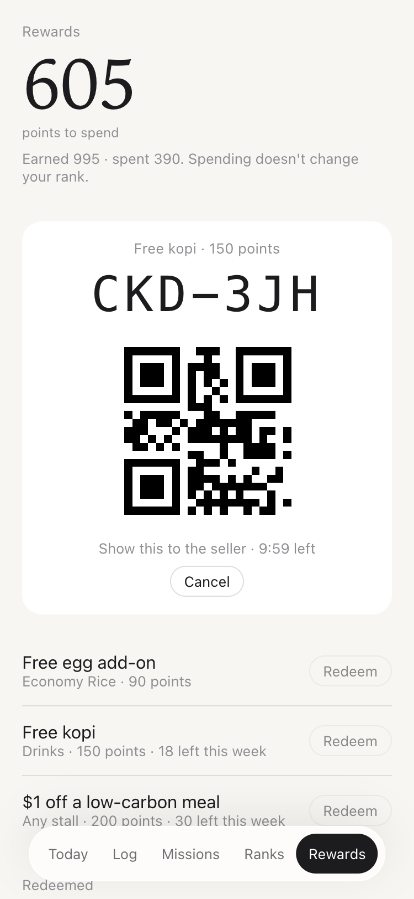
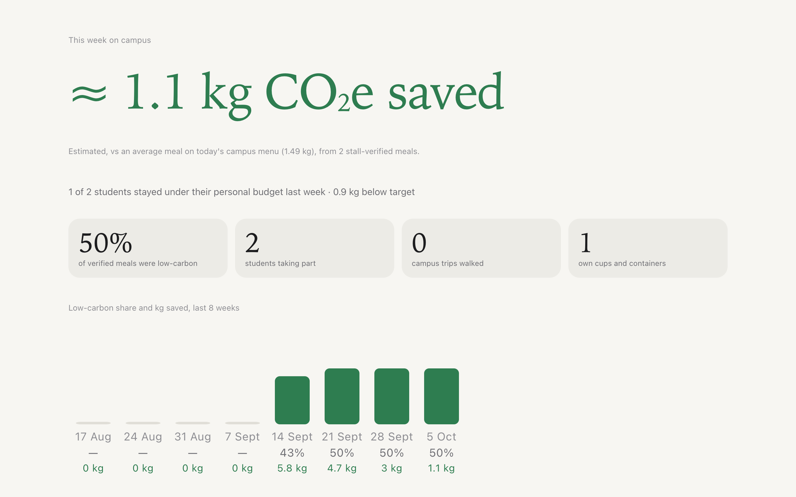
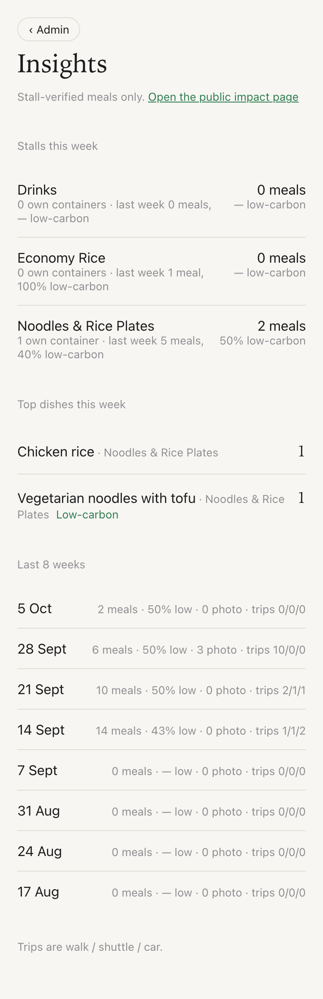

# Campus Carbon

A mobile web prototype for NTU CC0006. Students earn points for low-carbon canteen meals, verified by the stall through a QR code or an NFC tap. They also log trips, steps and container returns, take on missions, and spend points on stall rewards.

Live demo: https://campus-carbon.stan322.workers.dev, plus the projector page at `/impact`.

## Screenshots

<table>
  <tr>
    <td align="center"><br><sub>Today</sub></td>
    <td align="center"><br><sub>Seller shows a claim QR</sub></td>
    <td align="center"><br><sub>Log a trip</sub></td>
  </tr>
  <tr>
    <td align="center"><br><sub>Missions and badges</sub></td>
    <td align="center"><br><sub>Weekly recap card</sub></td>
    <td align="center"><br><sub>Rewards: live code</sub></td>
  </tr>
</table>

<p align="center">
  <br>
  <sub>Campus impact, the public projector page (<code>/impact</code>)</sub>
</p>

<p align="center">
  <br>
  <sub>Admin insights</sub>
</p>

<sub>Screenshots use the seeded demo data (personas Alex, Bea and Chen).</sub>

## What's in it

- **Verified claims:** the seller taps the item sold and the student scans a QR code or taps the NFC sticker. Codes are single-use and rate-limited.
- **Self-reported logging:** walking, shuttle and car trips over real campus routes (OSRM); steps; container returns; and meal photos estimated by AI. Self-reported points have a daily cap.
- **Progress:** missions, streaks, badges, a weekly leaderboard, a personal weekly carbon budget (85% of the student's first week), and a shareable weekly recap card.
- **Rewards:** a separate balance to spend, 6-character codes or QR codes confirmed at the stall (typed or scanned by camera), and weekly stock limits.
- **Admin:** stalls and items editor, menu import from a photo, points and limits, rewards editor, insights, and CSV exports.
- **AI (Gemini, optional):** typed trips, meal photos, menu import, and a weekly nudge. The AI never decides kg or the low-carbon flag; those come from emission factors (Poore & Nemecek via Our World in Data, and DESNZ 2022).

## Stack

A single Cloudflare Worker: Hono API under `/api/*`, D1 (SQLite), and a React 19 + Vite single-page app. Tests use Vitest against a `node:sqlite` D1 adapter.

## Run locally

```bash
npm install
cp .dev.vars.example .dev.vars   # dev-only secrets; add AI_API_KEY to use live AI
npm run db:local                 # migrations + seed data (personas, stalls, routes)
npm run dev
```

Without an AI key the app uses offline mock estimates, which earn no points. With `AI_MODE=live` and a key, each student gets a daily allowance of live AI calls (`ai_daily_max` in admin).

```bash
npm test
npm run typecheck
```

## Docs

- Design specs: `docs/superpowers/specs/`
- Implementation plans: `docs/superpowers/plans/`
- Real-phone demo checklist: `docs/demo-checklist.md`

## Licence

Code: [MIT](LICENSE). Data sources keep their own licences, including the OpenStreetMap-derived routes (ODbL). See [CREDITS.md](CREDITS.md).
